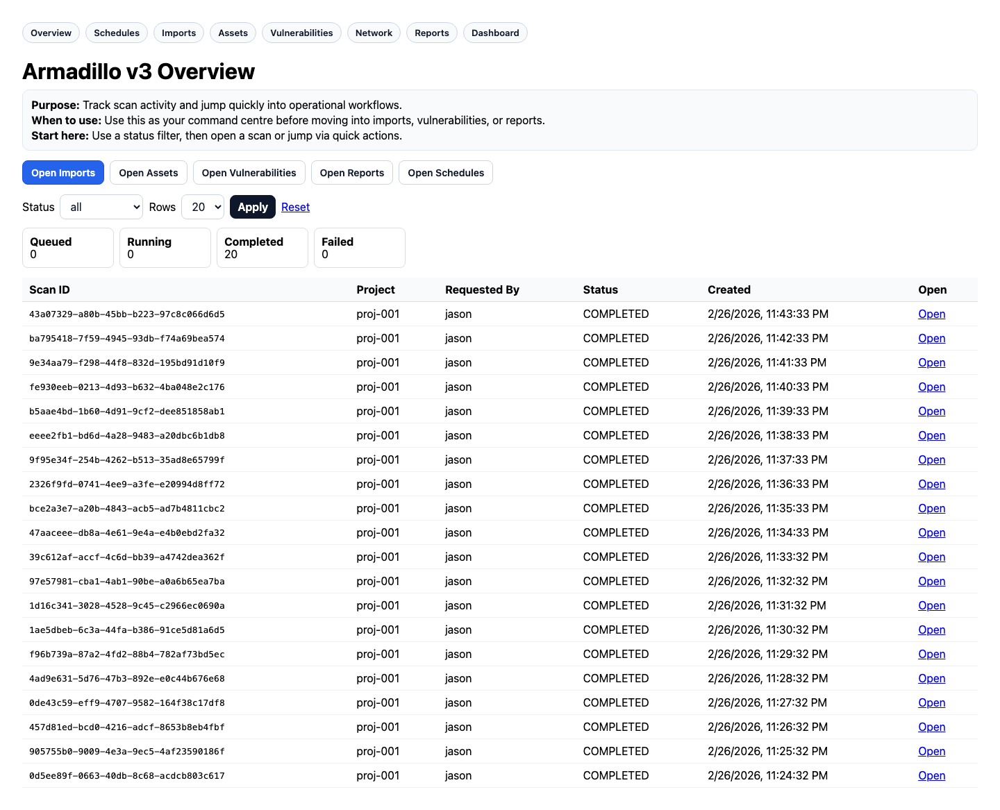
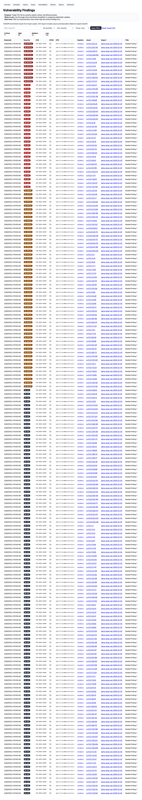
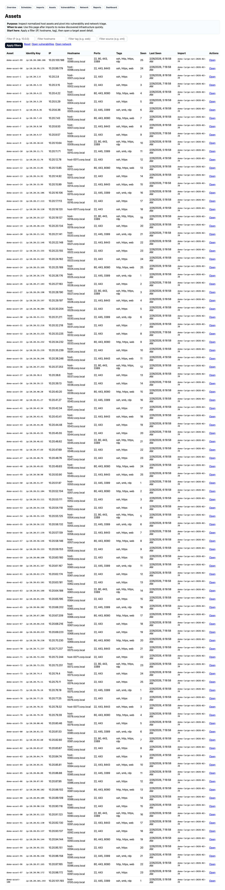
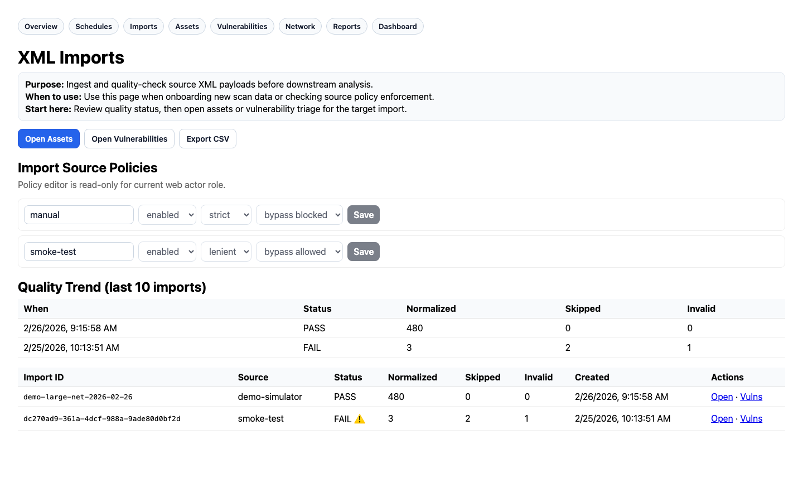
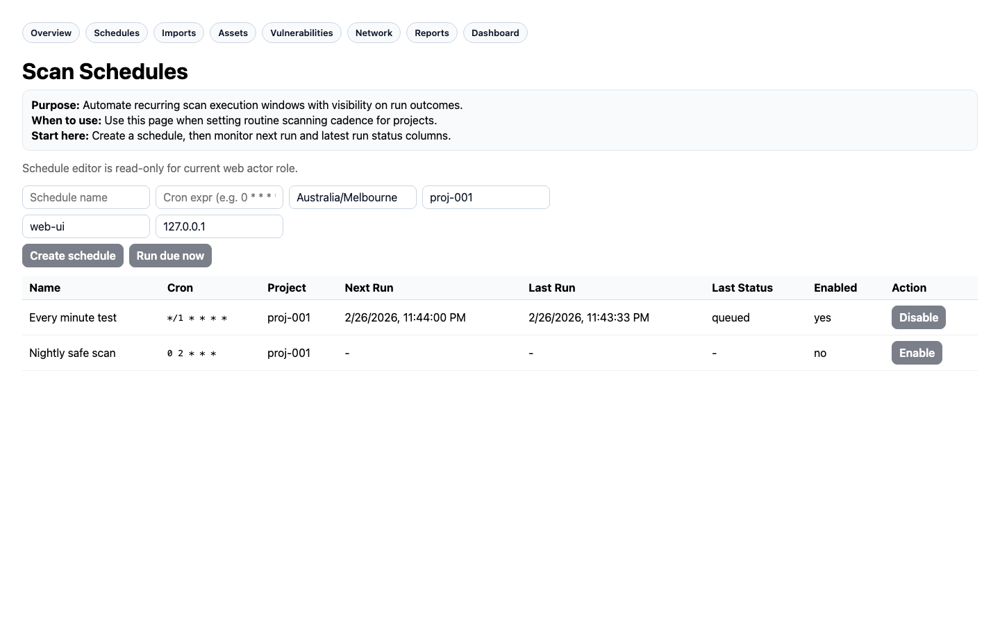
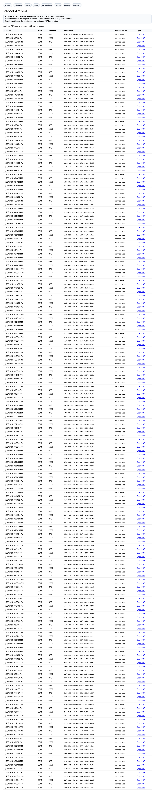

# 🛡️ Project Armadillo v3

Modern, queue-driven network discovery and security visibility platform.

## Specification Sync (v3.3)
- **Spec version:** 3.3 — Full Spec + Architecture + Security Hardening
- **Spec date:** 28 February 2026
- **Coverage:** 63 user stories across 26 sections, with complete architecture + data model roadmap
- **Source documents (archived):**
  - `docs/spec-sync/Project-Armadillo-v3.3-2026-02-28.docx`
  - `docs/spec-sync/Project-Armadillo-v3.3-2026-02-28.txt`
  - `docs/spec-sync/ArmadilloToolsMap-2026-02-28.tsx` (tools/data acquisition mapping UI artifact)
  - `docs/spec-sync/SprintPlanner-2026-02-28.tsx` (sprint sequencing/dependency planning UI artifact)

## Tightened Implementation Brief (from latest planning artifacts)
- **Program scope:** 74 planned items total (11 infra + 63 feature stories)
- **Delivery horizon:** 11 sprints / ~24 weeks (MVP target by Sprint 3)
- **Critical path:** `INFRA-05` → `INFRA-06` → `INFRA-11` → `US-INT.01` → `US-INT.03` → `US-8.08` → `US-AI.01` → `US-COMP.01` → `US-REV.02`
- **Execution model:** Open-source-first stack (Ollama, MinIO, SMTP, public intel feeds) with optional cloud upgrades only where needed.

## Current platform includes
- Next.js web app (`apps/web`)
- Fastify API (`apps/api`)
- BullMQ worker pipeline (`apps/worker`)
- Shared pipeline contracts (`packages/types`)
- PostgreSQL + Prisma migrations (`apps/api/prisma`)

---

## 🎯 Current Status (as of 2026-02-28)

| Phase | Status | Notes |
|-------|--------|-------|
| Phase 4 — Beta Hardening | ✅ **Complete** | Performance indexes, CI gates, threat model, rollback runbook |
| Phase 5 — Legacy Parity | ✅ **Complete** | Self-service submissions, notifications, private credentials, schedules |
| Phase 6 — Usability Modernization | 🔄 **U1 & U2 Complete** | Modern UI shell, mobile polish, demo dataset (480 assets, 720 vulns) |
| Phase 7 — Operator Confidence | 🔄 **Sprint 2 In Progress** | Triage velocity + risk prioritization intelligence |

### Phase 7 Sprint Breakdown

#### ✅ Sprint 1 — Remediation Focus (COMPLETE)
| Item | Feature | Deliverables |
|------|---------|--------------|
| 1 | **Vuln remediation tracking** | `assignedTo`, `dueDate`, `remediationStatus` + PATCH/POST endpoints + inline edit UI |
| 2 | **Global Cmd+K search** | `/api/v1/search` + modal UI with keyboard navigation |
| 3 | **Attention banner for failed scans** | `/api/v1/scans/attention` with 7-day trend + sparkline banner + retry |
| 4 | **Asset change badges** | `deltaSinceLast` column + badge UI (new/new_this_week/changed) |

#### 🔄 Sprint 2 — Risk Prioritization Intelligence (In Progress)
| Item | Feature | Status |
|------|---------|--------|
| 1 | **Exploitability-first grouping** | ✅ Filter tabs (All/🔥 Exploitable/📋 Theoretical), API stats + blast radius |
| 2 | **Blast radius chips** | ✅ Live API integration with hover tooltips |
| 3 | **Attack path simulation** | ✅ POST `/network/attack-path` — entry → target with hops + vulns |
| 4 | **Exposure scoring** | 🔲 Internet-facing detection + risk scoring |

---

## 🖼️ Visual Tour

Here's what Armadillo looks like in action — screenshots from the running application:

> **📸 Maintenance Note:** This visual tour is updated every time we ship major UI changes. See `scripts/take-screenshots.js` to regenerate. Last updated: 2026-02-27 (Phase 7 Sprint 2)

### 1. Overview — Command Centre


**Purpose:** Your security operations starting point. Track scan activity across all projects, see status counts at a glance, and jump quickly into operational workflows.

**Key Features:**
- **Status counters** — Queued, Running, Completed, Failed scan counts
- **Quick actions** — One-click access to Imports, Assets, Vulnerabilities, Reports, Schedules
- **Scan history table** — Filter by status, paginate through results, drill into individual scans
- **Mobile-responsive cards** — Same functionality, optimized for field access on phones/tablets

---

### 2. Vulnerabilities — Prioritised Action


**Purpose:** Stop drowning in CVE lists. Armadillo prioritises vulnerabilities by exploitability and business impact so you fix what matters first.

**Key Features:**
- **🔥 Exploitability-first grouping** — Split view between "Has Public Exploit" vs "📋 Theoretical Risk"
- **Blast radius chips** — See "affects 12 hosts" directly in the list without clicking through
- **Remediation tracking** — Assign tickets to staff, set due dates, track status (open/in_progress/resolved)
- **Inline editing** — Update assignee, status, and due date without leaving the page
- **CSV export** — Full vulnerability list with remediation fields for executive reporting

---

### 3. Assets — Change Awareness


**Purpose:** Know what you have, what's new, and what's changed. Asset inventory with intelligence, not just a spreadsheet.

**Key Features:**
- **Change badges** — "New today", "New this week", or "Changed" indicators on every asset
- **Delta tracking** — See port/service changes since last scan (+3 ports, -1 service)
- **Risk heatmap** — Aggregate vulnerability score per asset (critical count × exposure)
- **Global search** — Cmd+K to jump to any asset by IP, hostname, or scan ID
- **Filter & export** — Slice by project, status, or risk level; export for compliance reports

---

### 4. Network — Attack Path Visualisation


**Purpose:** Understand your attack surface visually. See topology, simulate lateral movement, and identify critical choke points.

**Key Features:**
- **Interactive topology** — Visual network graph with zoom, pan, and node selection
- **Attack path simulation** — "If entry point is X, can an attacker reach Y?" with vulnerability context per hop
- **Exposure scoring** — Internet-facing assets with critical vulnerabilities auto-surface
- **Service dependency mapping** — Web tier → DB tier → Backend logical groupings
- **Lateral movement detection** — Visualise how an attacker could pivot through your network

---

### 5. Imports — Quality Pipeline


**Purpose:** Ingest scan data from any source with confidence. Strict quality controls ensure garbage data doesn't pollute your security decisions.

**Key Features:**
- **XML import pipeline** — Upload Nessus/OpenVAS scans with strict or lenient quality modes
- **Quality analytics** — Success rate, skip reasons, invalid entries tracked over time
- **Reject artifacts** — Download rejected records for fixing and re-import
- **Source policy governance** — Enforce which import sources are trusted
- **CSV exports** — Full import history with quality metrics for auditing

---

### 6. Schedules — Automated Coverage


**Purpose:** Set it and forget it. Schedule recurring scans with conflict detection to ensure continuous coverage without overwhelming your network.

**Key Features:**
- **Cron expression support** — Flexible scheduling (daily, weekly, monthly, custom)
- **Conflict warnings** — Alert if two schedules hit the same CIDR at the same time
- **Pause with reason** — "Paused: Customer maintenance window" annotations
- **Auto-queue digests** — Summary emails when scheduled scans complete
- **Project-scoped** — Schedules respect project boundaries for multi-tenant MSP use

---

### 7. Reports — Distribution Ready


**Purpose:** Close the loop with stakeholders. Generate executive summaries, technical details, and compliance documentation automatically.

**Key Features:**
- **PDF exports** — One-click PDF generation for imports, scans, and vulnerability lists
- **Report automation** — Scheduled reports with archive and digest
- **Delivery tracking** — "Sent/Pending/Acknowledged" workflow for client reports
- **Failure alerting** — Auto-Teams notification if report generation fails
- **Multi-format** — PDF, CSV, and raw data exports for different audiences

---

## 💡 Why We Built Armadillo

### The Problem

Most security tools fall into two camps:

1. **Enterprise SIEMs** — Powerful but complex, expensive, and require dedicated teams to operate
2. **Open-source scanners** — Free but fragmented, requiring manual stitching of outputs and tribal knowledge

**Small-to-mid MSPs (10-50 employees) are underserved.** They need:
- Visibility into client networks without 6-figure tooling costs
- Prioritisation that actually helps them decide what to fix first
- Workflows that junior staff can run without senior oversight
- Reporting that proves value to clients without manual PowerPoint assembly

### The Solution

Armadillo bridges the gap between "we run Nessus occasionally" and "we have a SOC." It provides:

| Capability | Business Value |
|------------|----------------|
| **Exploitability-first prioritisation** | Fix 20% of vulns that prevent 80% of breaches |
| **Attack path simulation** | Understand actual risk, not just theoretical CVSS scores |
| **Remediation tracking** | Hold staff accountable, measure time-to-fix, demonstrate improvement |
| **Automated reporting** | Reduce report assembly from 4 hours to 10 minutes |
| **Change awareness** | Spot new assets and drift before they become shadow IT |
| **Quality-controlled imports** | Trust your data — bad imports don't pollute your security decisions |

### Who It's For

- **MSP owners** who want to offer "security as a service" without hiring a dedicated security team
- **IT managers** who need to prove security posture to auditors and boards
- **Security analysts** who are tired of spreadsheet-driven vulnerability management
- **Compliance officers** who need evidence of continuous monitoring and timely remediation

### Competitive Differentiation

| Feature | Armadillo | Generic Scanner | Enterprise SIEM |
|---------|-----------|-----------------|-----------------|
| Deploy time | 5 minutes (Docker) | Hours of config | Weeks of professional services |
| Exploitability focus | ✅ Built-in | ❌ Manual research | ✅ Available (expensive add-on) |
| Attack path simulation | ✅ Included | ❌ Not available | ✅ Available (separate module) |
| Remediation workflow | ✅ Native | ❌ External ticketing required | ⚠️ Complex integration |
| Multi-tenant MSP mode | ✅ Designed for it | ❌ Single org only | ⚠️ Expensive licensing |
| Cost | Free (self-hosted) + support | Free to $5K/year | $50K-$500K/year |

### The Bottom Line

Armadillo turns security scanning from a "checkbox compliance activity" into a **continuous, actionable, measurable security program**.

It won't replace a dedicated security team for a Fortune 500. But for the thousands of MSPs and mid-market companies who need *good enough* security visibility without *enterprise* complexity, it's the Goldilocks solution.

---

## 🗺️ Future Roadmap

Roadmap is now aligned to the v3.3 planning set (74 items: 11 infra + 63 feature stories) with a dependency-mapped sprint sequence.

### Delivery timeline (planned)
- **Sprint 0 (2w): Foundation & Infra** — RBAC models, RLS, Prisma scoping middleware, Zod validation, EPSS/KEV workers, scoring package, MinIO, notification router, Ollama gateway.
- **Sprint 1 (2w): Intelligence + Core UX** — EPSS/KEV surfacing, composite risk scoring, bulk remediation extension, vulnerability aging/SLA warnings, saved views.
- **Sprint 2 (2w): Auth + PSA + AI** — API keys, ConnectWise/Halo ticketing, AI remediation guidance, multi-tenant dashboard aggregation.
- **Sprint 3 (2w): Compliance + Revenue** — Essential Eight mapping, posture score (client-facing), pre-sales risk report, runbook library + evidence foundation.
- **Sprint 4–8 (10w): Scale, automation, and ops maturity** — webhooks, Teams/Slack routing, digests, customer portal, advanced compliance, AI suite, RMM sync, evidence/report packs, dashboard customisation, SIEM/IaC/K8s options.
- **Sprint 9–10 (6w): Phase 9 Host Telemetry track** — Linux + Windows agents, eBPF/ETW telemetry, FIM, remote response, CIS benchmark coverage.

### MVP target
- **MVP window:** Sprints 0–3 (**~8 weeks**)
- **MVP outcomes:** exploitability-led prioritisation, PSA-linked remediation workflow, posture/compliance baseline, and client-grade reporting foundation.

### Critical path (must protect)
`INFRA-05 → INFRA-06 → INFRA-11 → US-INT.01 → US-INT.03 → US-8.08 → US-AI.01 → US-COMP.01 → US-REV.02`

### Execution principles
- **Open-source-first by default:** Ollama, MinIO, SMTP, public intelligence feeds.
- **Cloud optionality, not dependency:** only where value materially exceeds local-hosted path.
- **Queue-driven reliability:** background jobs and retries for all integration-heavy flows.

---

## Quick Start (one command)
```bash
make up
```

### Local URLs
- Web: <http://localhost:3000>
- API health: <http://localhost:4000/health>

### API Auth Headers
- `x-armadillo-user: <actor>`
- `x-armadillo-role: owner|admin|staff|viewer`

### Key API Endpoints

**Vulnerability Management (Phase 7)**
```bash
# Exploitability filtering
curl 'http://localhost:4000/api/v1/vulns?hasExploit=true'
curl 'http://localhost:4000/api/v1/vulns/stats/exploitability'

# Blast radius for a CVE
curl 'http://localhost:4000/api/v1/vulns/CVE-2024-6387/blast-radius'

# Attack path simulation
curl -X POST 'http://localhost:4000/api/v1/network/attack-path' \
  -H 'content-type: application/json' \
  -d '{"entryAssetId":"...","targetAssetId":"..."}'

# Update remediation
curl -X PATCH 'http://localhost:4000/api/v1/vulns/123' \
  -H 'content-type: application/json' \
  -H 'x-armadillo-role: staff' \
  -d '{"assignedTo":"jason","dueDate":"2026-03-15","remediationStatus":"in_progress"}'

# Bulk update
curl -X POST 'http://localhost:4000/api/v1/vulns/bulk-update' \
  -H 'content-type: application/json' \
  -H 'x-armadillo-role: staff' \
  -d '{"ids":[1,2,3],"remediationStatus":"resolved"}'
```

**Global Search**
```bash
curl 'http://localhost:4000/api/v1/search?q=CVE-2024'
```

**Scan Management**
```bash
# Queue scan
curl -X POST http://localhost:4000/api/v1/scans \
  -H 'content-type: application/json' \
  -H 'x-armadillo-user: jason' \
  -H 'x-armadillo-role: staff' \
  -d '{
    "projectId": "proj-001",
    "requestedBy": "jason",
    "targets": [{"value": "192.168.1.0/24", "type": "cidr"}],
    "config": {"profile": "safe-default"}
  }'

# Failed scans attention
curl 'http://localhost:4000/api/v1/scans/attention'

# Retry failed scan
curl -X POST 'http://localhost:4000/api/v1/scans/<scanId>/retry'
```

**Asset Management**
```bash
# List assets with change badges
curl 'http://localhost:4000/api/v1/assets?badges=true'

# Import XML
curl -X POST http://localhost:4000/api/v1/imports/xml \
  -H 'content-type: application/json' \
  -H 'x-armadillo-user: jason' \
  -H 'x-armadillo-role: staff' \
  -d '{"source":"manual","qualityMode":"strict","xml":"<assets>...</assets>"}'
```

### Helpers
```bash
make ps      # containers status
make logs    # tail logs
make test    # health + queue smoke test
make down    # stop stack
make clean   # down + volumes + dangling image prune
```

### First-time bootstrap (macOS)
```bash
make bootstrap
colima start
```

---

## 📚 Docs
- `docs/armadillo-v3-architecture.md`
- `docs/armadillo-v3-roadmap-90d.md`
- `docs/armadillo-v3-tooling-matrix.md`
- `docs/phase7-improvements-roadmap.md` — Operator confidence features
- `docs/sprint-phase7-1.md` — Sprint 1 completion (remediation tracking)
- `docs/sprint-phase7-2.md` — Sprint 2 progress (risk prioritization)
- `docs/phase9-host-telemetry-roadmap.md` — Host agents & endpoint awareness
- `docs/ops-register.md` — Current operational status & decisions
- `k8s/` — Kubernetes deployment specs
- `docs/infrastructure/ARMADILLO-SCALE-PLAN.md` — Scale infrastructure blueprint

---

## 🔒 Operational Security Posture
- Signed session auth enabled for API
- Legacy header trust disabled in production
- Project scope enforcement active for scan/schedule paths
- Auth audit and lockout controls active
- Multi-tenant isolation strategy documented as dual-layer: Prisma project scoping + PostgreSQL RLS (spec requirement)
- Zod validation at API/external boundaries is a mandatory hardening requirement in v3.3 spec
- Dev mode alert suppression available (`ARMADILLO_DEV_MODE=1`)

---

*Built with ❤️ by Comans Services — from reactive IT to proactive security.*
