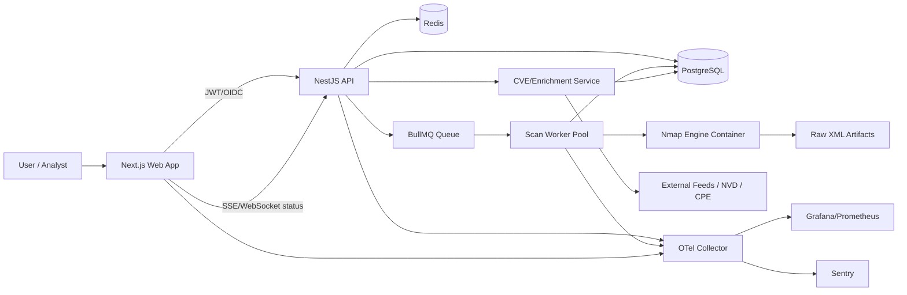

# Project Armadillo v3 — Option A Architecture (TypeScript-first)

## Stack
- **Frontend:** Next.js (App Router) + Tailwind + Cytoscape/ECharts
- **API:** NestJS (Fastify adapter) + OpenAPI
- **Workers:** BullMQ + Redis
- **DB:** PostgreSQL + Prisma
- **Auth:** OIDC/SAML via Auth0 or Keycloak (RBAC + MFA)
- **Infra:** Docker + Terraform + managed Postgres/Redis
- **Observability:** OpenTelemetry + Prometheus/Grafana + Sentry

## System Diagram

## Runtime Boundaries
- **Web app:** UI only, no direct scanner execution.
- **API:** AuthZ, tenancy, CRUD, orchestration, reporting endpoints.
- **Worker:** Executes scans/import parsing with constrained capability profile.
- **Scanner container:** Runs `nmap` under restricted network/file policies.

## Security Baseline
- No debug mode in prod, strict CORS/CSRF policies.
- Secrets from runtime secret manager (no repo secrets).
- RBAC by org/project/asset group.
- Immutable audit log for scan launches, edits, exports.
- Signed job payloads and worker allowlist execution profiles.

## Core Domain Objects
- `users`, `orgs`, `projects`
- `scan_jobs`, `scan_runs`, `scan_artifacts`
- `hosts`, `services`, `ports`, `cpe`, `cve_findings`
- `labels`, `notes`, `diff_reports`, `pdf_reports`
- `api_clients`, `audit_events`
